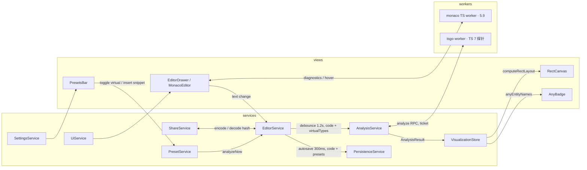

# 工程架构设计

架构要同时服务两个目标：期 1 只做 TypeScript，但多语言 ADT 扩展是硬约束；教学工具的正确性优先，渲染层不允许拿到「可能在说谎」的数据。因此分层的核心动作是定义一个语言无关的「集合语义 IR」，把语言知识压在 adapter 一层，IR 之上的所有代码（布局、渲染）不认识 TypeScript

## 分层与依赖规则

```
views  ──▶  services  ──▶  core
                │
                ▼
        adapters/typescript (worker)
```

依赖只指向内层（core 最内），反向依赖一律禁止：

1. **core** —— 语言无关的纯函数层：集合语义 IR 类型定义、矩形包含布局引擎（等价类合并、包含森林、递归网格平分）。零外部依赖、零副作用，任何函数可在 Node 里直接单测
2. **adapters** —— 语言知识层：`LanguageAdapter` 接口 + TypeScript 实现。语义分析运行在独立 Web Worker 里（tsgo-wasm 诊断探针），输入源码 + 虚拟预设、输出 IR；main 线程侧只有 adapter 描述符（id、monaco 语言 id、预设目录、示例代码、引擎标识）
3. **services** —— 应用状态与用例编排：power-di 注册，mobx observable 承载状态。业务逻辑全部在这一层，view 不写逻辑
4. **views** —— React 组件：只做「observable → 渲染」与「UI 事件 → service 方法」两种转换，`observer` 包裹，不持有状态、不做计算

## 集合语义 IR（多语言扩展的契约）

IR 是 adapter 与上层之间的唯一数据契约（v2，矩形范式后无 cells / 原子概念），新语言只需要产出同样的 IR：

- `TypeEntity` —— 一个被展示的类型：名字、源码文本（typeText）、特殊角色（`none | universe | empty | outside-set-theory`）、来源（`code | preset`）、声明位置（预设为 null）
- `PairRelation` —— entity 两两关系：`equivalent | subset | superset | unrelated`；`unrelated` 表示双向都不可赋值，布局渲染为并列矩形（部分重叠不作区分，[ADR-0012](../adr/0012-可视化范式-矩形包含布局.md)）
- `SourceDiagnostic` —— 用户代码诊断，error 存在时画布保持上次结果
- `AnalysisResult` —— `{ entities, relations, diagnostics, anyEntityNames }`

`LanguageAdapter` 接口（main 线程侧，v2）：

```ts
interface LanguageAdapter {
  id: string // 'typescript'
  label: string
  editorLanguageId: string
  presets: LanguagePreset[] // virtual | snippet 双轨目录
  sampleSource: string
  engineLabel: string // e.g. 'TypeScript 7 (tsgo-wasm)'
  analyze(source: string, virtualTypes: VirtualType[]): Promise<AnalysisResult>
  dispose(): void
}
```

Header 语言选择器切换的就是 adapter 实例；渲染与布局代码只消费 IR，这是「本期只做 TS、但架构支持多语言」的实现点

## 双 worker 架构

- **monaco 内置 TS worker**（TypeScript 5.9）：负责编辑体验 —— 诊断、补全、编辑器内 hover。monaco 自带，零定制
- **tsgo 分析 worker**（TypeScript 7）：vendored Go js/wasm runtime + 内存 fs shim 跑 tsgo-wasm，每次分析构造探针文件、一次 tsc run、解析诊断得出关系矩阵（[ADR-0013](../adr/0013-引擎切换-tsgo-wasm.md)）

两个 worker 版本口径不同（编辑器 5.9、引擎 7）是已接受的代价，Footer 明示引擎版本、分歧以引擎为准。typescript@5.9 npm 包保留仅作 parser（export 扫描），不碰 checker

分析请求带单调递增的 ticket，返回时校验：过期结果直接丢弃，画布永远呈现最新一次成功分析

## 数据流



状态的唯一事实源：代码文本在 `EditorService`，virtual 预设开关在 `PresetService`，分析结果在 `AnalysisService`；布局是 `VisualizationStore` 的派生数据（computed，输入为分析结果 + 实测视口），不单独存储

## services 职责表

| service              | 职责                                                             | 不负责                |
| -------------------- | ---------------------------------------------------------------- | --------------------- |
| `EditorService`      | 代码文本事实源、防抖提交、snippet 自动编号插入                   | 类型分析              |
| `PresetService`      | 预设目录与 virtual 开关状态、双轨行为分发                        | 布局                  |
| `AnalysisService`    | 调度 tsgo worker：ticket 管理、过期作废、last-good 与诊断分离    | 解析细节（worker 内） |
| `VisualizationStore` | 派生矩形布局（computed）、视口实测、hover/光标高亮、tooltip 堆叠 | 语义判定              |
| `PersistenceService` | IndexedDB 读写：代码 + presets                                   | 编码分享链接          |
| `ShareService`       | URL hash 编解码（envelope 带版本）、剪贴板                       | 存储                  |
| `UiService`          | 响应式断点、编辑器抽屉开合与宽度                                 | 业务状态              |
| `SettingsService`    | i18n locale                                                      | 业务状态              |

power-di：容器在应用入口组装，adapter 与各 service 的具体实现只在组装点出现；views 通过 hook 取 service 接口

## 目录结构约定

```
src/
├── core/
│   ├── set-model/      # IR types (pure)
│   ├── analysis/       # LanguageAdapter contract
│   └── layout/         # rect containment layout (pure)
├── adapters/
│   └── typescript/
│       ├── analyzer/         # scan-exports, probe planner, go runtime, mem-fs, runners
│       ├── analysis.worker.ts
│       ├── adapter.ts        # main-thread descriptor
│       └── presets.ts
├── services/
├── views/
├── i18n/
└── routes/             # TanStack Start routes
```

## SOLID 对应

- **S**：每个 service 一个职责（上表），view 只渲染；core 两个子模块各管 IR / 布局
- **O**：新语言 = 新增一个 adapter 实现，core / services / views 零修改
- **L**：adapter 可替换性由 IR 契约 + 一套跨 adapter 的契约测试保证（同样的 IR 断言跑在每个 adapter 上）
- **I**：views 依赖各 service 的最小接口；worker RPC 面只有 `analyze`
- **D**：services 依赖 `LanguageAdapter` / 存储接口等抽象，具体实现（TS adapter、IndexedDB）在组装点注入

## 架构级不变量

这些断言写进代码（测试 + 运行时防护），违反即 bug：

1. **canary 防毒化**：分析引擎的空诊断流必须 throw 而非返回结果 —— 引擎未真实运行时的输出会被哨兵规则误判成全 any，宁可 failed 保持上次画面（[ADR-0013](../adr/0013-引擎切换-tsgo-wasm.md)）
2. 布局纯函数确定性：同一 `AnalysisResult` + 同一视口，输出逐字节一致；对 relations 数组顺序不敏感
3. tsgo / TS 内部知识不越过 adapter 边界；IR 里没有任何 TS 专有概念
4. view 组件内不出现业务分支（超过纯渲染映射的逻辑一律下沉 service）
