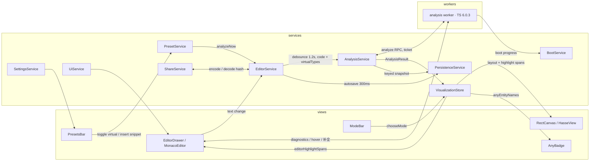

# 工程架构设计

架构要同时服务两个目标：期 1 只做 TypeScript，但多语言 ADT 扩展（Rust / Golang 已确认方向）是硬约束；教学工具的正确性优先，渲染层不允许拿到「可能在说谎」的数据。因此分层的核心动作是定义一个语言无关的「集合语义 IR」，把语言知识压在 adapter 一层，IR 之上的所有代码（布局、渲染）不认识 TypeScript

## monorepo 包结构与依赖规则（ADR-0021）

仓库是 pnpm + TypeScript monorepo，分层由包依赖图物理强制（违例直接编译不过），依赖只指向内层：

| 包                              | 内容                                                                                                             | 依赖                        |
| ------------------------------- | ---------------------------------------------------------------------------------------------------------------- | --------------------------- |
| `@typarium/set-model`           | 集合语义 IR、关系代数（等价类合并 / 包含结构）、画布几何契约（Box / Viewport / LayoutInput / 常量 / 调色板 CSS） | 零                          |
| `@typarium/diagram-euler`       | 矩形包含布局 + faithfulness 探测 + EulerDiagram 受控组件                                                         | set-model                   |
| `@typarium/diagram-hasse`       | 分层 Hasse 布局 + HasseDiagram 受控组件                                                                          | set-model                   |
| `@typarium/language-adapter`    | LanguageAdapter 契约 + FakeLanguageAdapter + 跨 adapter 契约测试套件                                             | set-model                   |
| `@typarium/analyzer-typescript` | TypeScript 分析器（checker 直查 + witness 修正）、descriptor、ATA；node 直接可用                                 | set-model、language-adapter |
| `apps/web`                      | services、views、monaco 集成、worker 胶水、启动管线、持久化、i18n                                                | 全部                        |

- 包内部相对引用；跨包一律走包名。工作区内通过 `typarium-source` exports condition 直接消费 src（vite / vitest / tsc 三方一致）；对外发布走 `pnpm build:packages` 产出 dist + d.ts 的默认 condition
- `typescript` 包的 import 只存在于 `analyzer-typescript`；exact pin 6.0.3（[ADR-0015](../adr/0015-统一单一-typescript-资源-6.0.3.md)）
- 绘制组件是受控 props 形态（layout 进、定位 div 出），不含 store / i18n / tailwind，样式与调色板随包分发、CSS 变量可覆盖；产品语义（tooltip 内容、never 图例、any 徽章）留在 apps/web
- 新语言 = 新增一个 analyzer 包实现契约，core 三包与 apps/web 的 services / views 零修改

## LanguageAdapter 契约（ADR-0019）

唯一事实源是 `packages/language-adapter/src/adapter.ts`（此处不复制接口快照，避免文档漂移）。形状分四块：

1. **descriptor（纯数据）**：id、label、editorLanguageId、presets、sampleSource、engineLabel、compilerOptionsDisplay、`specialTypeNames`（universe / empty / any 在该语言的名字，views 只准渲染这些字段）、`snippet`（自动编号声明语法）、可选 `sampleAnalysis`（构建期算好的示例分析结果）
2. **分析核心（必选）**：`analyze` / `check` —— 新语言的最小交付
3. **编辑器能力（可选）**：quickInfo / completions / format / inlineQueries，能力缺失时 UI 降级（隐藏按钮、不注册 provider）
4. **事件面**：`onTypesAcquired` 与 `onBootProgress`，多订阅、返回退订函数

可替换性由契约测试套件保证：`describeAdapterContract` 用同一组 IR 断言跑每个实现，当前覆盖 TypeScript 分析器（node 直跑，不经 worker）与 fake 参考语言（`set CN = a | b` 值集合语义，非 TS 语法故意用来证明边界不漏）

## 集合语义 IR（多语言扩展的契约）

IR 是 adapter 与上层之间的唯一数据契约（v2，矩形范式后无 cells / 原子概念），新语言只需要产出同样的 IR：

- `TypeEntity` —— 一个被展示的类型：名字、源码文本（typeText）、一层展开文本（expandedText）、特殊角色（`none | universe | empty | outside-set-theory`）、来源（`code | preset`）、声明位置（预设为 null）
- `PairRelation` —— entity 两两关系：`equivalent | subset | superset | unrelated`；`unrelated` 表示双向都不可赋值（部分重叠不作区分，[ADR-0012](../adr/0012-可视化范式-矩形包含布局.md)）
- `SourceDiagnostic` —— 带 domain 分类（`syntax | type | value`）：判断错误属于哪个 domain 需要 AST 知识、在 adapter 内完成；「value 域错误不阻塞画布」是产品规则、在 service 层一个判断完成
- `AnalysisResult` —— `{ entities, relations, diagnostics, anyEntityNames }`

## 单一分析 worker（ADR-0015）

- **一个 worker、一份 TypeScript（6.0.3 exact pin）**：`checker.isTypeAssignableTo` 双向查询 + sentinel witness 修正非传递可赋值性得出关系矩阵；同一个 LanguageService 供给编辑器诊断（350ms 快速 check → markers）、hover、补全
- **monaco 不加载内嵌 TS worker**：编辑器只保留 monarch 语法高亮，语义能力全部来自分析 worker 的 provider 注册
- lib.d.ts 不打进 worker chunk：构建期剥离注释产出 JSON 资产，worker fetch 流式加载并上报字节进度（[ADR-0020](../adr/0020-启动管线显式化与缓存优先渲染.md)）；prettier 与 twoslash 是懒加载分包
- 分析请求带单调递增的 ticket，返回时校验：过期结果直接丢弃，画布永远呈现最新一次成功分析

## 启动管线与缓存优先渲染（ADR-0020）

启动是显式管线，`BootService` 持有 observable 阶段状态（引擎下载 / 引擎初始化 / 内容恢复 / 首次分析），进度全部来自真实信号（字节分数与阶段完成），画布覆盖层展示进度条与当前环节

「可用」提前到引擎就绪之前，靠两条缓存优先路径，都受同一条真实性约束（key 必须精确匹配，引擎就绪后重验证替换）：

1. 首次访问：示例代码的 AnalysisResult 在构建期由同一 pin 的 typescript 算好、随 app chunk 内联（`sample-snapshot.gen.json`，提交入库、构建时校验新鲜）
2. 回访：上次 last-good 结果连同（engineLabel, code, presets）key 存 IndexedDB，命中即上屏

冷启动性能由 `pnpm perf:cold` 度量（共享带宽令牌桶代理，page 与 worker 流量同链竞争）；monaco 延后到首次分析落地再加载，preload 注入把 chunk 发现拉平到 HTML 解析期

## 布局模式策略（ADR-0018）

Euler / Hasse 切换是应用层策略、不在布局包内：`VisualizationStore` 以 `userMode`（用户选择，null = 未选）与 probe 结果派生 `effectiveMode` —— 默认 Euler，画不出自动落 Hasse 并禁用选项，恢复可画且未手动选过 Hasse 则自动回 Euler，只有手动选 Hasse 才固定。两个布局包互不知晓，模式选择器的示例图用同一批受控组件渲染固定输入

## 数据流

状态的唯一事实源：代码文本在 `EditorService`，virtual 预设开关在 `PresetService`，分析结果在 `AnalysisService`，图型选择与光标 offset 在 `VisualizationStore`；布局、光标高亮实体、编辑器高亮 span 全部是 computed 派生 —— 只存源头值、不存派生值

## services 职责表

| service              | 职责                                                                                        | 不负责                   |
| -------------------- | ------------------------------------------------------------------------------------------- | ------------------------ |
| `EditorService`      | 代码文本事实源、三路防抖（analyze 1.2s / check 350ms / save 300ms）、snippet 插入的文档编辑 | 声明语法（adapter）      |
| `PresetService`      | 预设目录与 virtual 开关状态、双轨行为分发                                                   | 布局                     |
| `AnalysisService`    | 调度 adapter：ticket 管理、last-good 与诊断分离、缓存水合                                   | 解析细节（worker 内）    |
| `VisualizationStore` | 图型策略（ADR-0018）、派生布局、等价类 hover、双向高亮                                      | 语义判定                 |
| `BootService`        | 启动阶段状态与真实进度                                                                      | 引擎细节（adapter 上报） |
| `PersistenceService` | IndexedDB：文档 + 分析快照                                                                  | 编码分享链接             |
| `ShareService`       | URL hash 编解码（版本化 envelope）、剪贴板                                                  | 存储                     |
| `UiService`          | 响应式断点、编辑器抽屉开合与宽度                                                            | 业务状态                 |
| `SettingsService`    | i18n locale、编辑器风格配置                                                                 | 业务状态                 |

power-di：容器在 `container.ts` 组装，adapter 与各 service 的具体实现只在组装点出现；views 通过 hook 取 service。`EditorService` 与 `PresetService` 的互相依赖靠组装点的 setter 接线（已知的时序耦合，输入源再增加时拆用例编排层）

## 测试形态

- 包内纯函数：property-based（fast-check）表达布局确定性、包含几何、乱序不敏感
- `analyzer-typescript`：真实 checker 的集成单测（node 直跑）+ 契约套件
- services：FakeLanguageAdapter（手动 resolve）驱动的时序单测 —— 防抖、ticket 竞态、编解码 roundtrip、模式策略、水合语义
- e2e：断言 `window.__typarium` 语义探针（真实 service 类型），不耦合 DOM 细节

## SOLID 对应

- **S**：services 职责表名实相符；三个布局 / 语义包各管一件事
- **O**：新语言 = 新 analyzer 包，上层零修改；新布局模式 = 新 diagram 包 + store 策略一处
- **L**：adapter 可替换性由契约测试套件实证（TypeScript 与 fake 两个实现同套断言）
- **I**：契约按「必选核心 + 可选能力」分组，语言可以只交 analyze / check
- **D**：services 依赖契约抽象，具体实现（TS adapter、IndexedDB）在组装点注入；包依赖图把方向变成编译期事实

## 架构级不变量

这些断言写进代码（测试 + 运行时防护），违反即 bug：

1. **witness 修正**：TS 可赋值性刻意不传递（`{}` 与 `object` 互相可赋值、`string ⊆ {}` 但 `string ⊄ object`），任何 A ⊆ B 判定必须对 witness 集合单调成立，否则不同的集合会被错误合并（[ADR-0015](../adr/0015-统一单一-typescript-资源-6.0.3.md)）
2. 布局纯函数确定性：同一 `LayoutInput` 输出逐字节一致；对 relations 数组顺序不敏感
3. 语言知识不越过 adapter 边界；IR 与 views / services 里没有任何 TS 专有概念，special 显示名与 snippet 语法只来自 descriptor
4. view 组件内不出现业务分支（超过纯渲染映射的逻辑一律下沉 service）
5. 缓存优先渲染的真实性：快照 key（engineLabel, code, presets）必须精确匹配才水合，且引擎就绪后必然重验证
