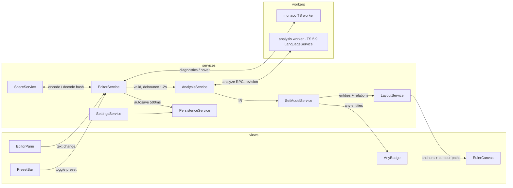

# 工程架构设计

架构要同时服务两个目标：期 1 只做 TypeScript，但多语言 ADT 扩展是硬约束；教学工具的正确性优先，渲染层不允许拿到「可能在说谎」的数据。因此分层的核心动作是定义一个语言无关的「集合语义 IR」，把语言知识压在 adapter 一层，IR 之上的所有代码（关系计算、布局、渲染）不认识 TypeScript

## 分层与依赖规则

```
views  ──▶  services  ──▶  core
                │
                ▼
        adapters/typescript (worker)
```

依赖只指向内层（core 最内），反向依赖一律禁止：

1. **core** —— 语言无关的纯函数层：集合语义 IR 类型定义、关系格计算（由原子集推导 子集/等价/不相交/相交/未知）、布局模型（锚点分配、轮廓输入构造）。零外部依赖、零副作用，任何函数可在 Node 里直接单测
2. **adapters** —— 语言知识层：`LanguageAdapter` 接口 + TypeScript 实现。TS 分析引擎运行在独立 Web Worker 里，输入源码、输出 IR；main 线程侧只有 adapter 描述符（id、monaco 语言 id、预设清单、worker 工厂）
3. **services** —— 应用状态与用例编排：power-di 注册，mobx observable 承载状态。业务逻辑全部在这一层，view 不写逻辑
4. **views** —— React 组件：只做「observable → 渲染」与「UI 事件 → service 方法」两种转换，`observer` 包裹，不持有状态、不做计算

## 集合语义 IR（多语言扩展的契约）

IR 是 adapter 与上层之间的唯一数据契约，新语言只需要产出同样的 IR：

- `SetUniverse` —— 该语言的全集切分描述：`Domain[]`，固定底图的数据来源
- `Domain` —— 基底域：id、标签、可选子域（如 object 域内的 function / array 子域）；TS 宇宙的切分见[功能技术设计](../design/功能技术设计.md#固定基底域)
- `Atom` —— 最小非空区域单元：整域原子（一个 Domain）、字面量点原子、域内细分原子（动态计算）
- `TypeEntity` —— 一个被展示的类型：名字、源码文本、展开后类型文本、声明位置
- `Region` —— entity 的覆盖表达：原子 id 集合，或特殊态（`any`、`never`、空集）
- `RelationMatrix` —— entity 两两关系：`equal | subset | superset | disjoint | overlap | unknown`，其中 `unknown` 是一等状态（「重叠未知」），渲染层必须区别对待
- `Deviation` —— 该语言偏离纯集合语义的标注点：any、方法参数双向协变、void 特例等，渲染为图上的偏差角标

`LanguageAdapter` 接口（main 线程侧）：

```ts
interface LanguageAdapter {
  id: string // 'typescript'
  monacoLanguageId: string
  presets: PresetDescriptor[]
  universe: SetUniverse // static basemap description
  createAnalyzer(): AnalyzerHandle // spawns the analysis worker, exposes analyze()/quickInfo()
}
```

Header 语言选择器切换的就是 adapter 实例；渲染与布局代码只消费 IR，这是「本期只做 TS、但架构支持多语言」的实现点

## 双 worker 架构

- **monaco 内置 TS worker**：负责编辑体验 —— 诊断、补全、编辑器内 hover。monaco 自带，零定制
- **独立分析 worker**：typescript（pin 5.9.x）+ @typescript/vfs 起 LanguageService，暴露 `analyze(code) → AnalysisResult(IR)` 与 `quickInfo(position)` 两个 RPC；画布 hover 的类型展开也从这里取

两份 TS 实例、lib.d.ts 双份内存（MB 级）是已接受的代价，换取：分析引擎与 monaco 完全解耦（多语言 adapter 各带各的 worker，接口统一）、编辑器可替换。TS Playground 的 `customWorkerPath` 扩展路线被否决，理由见 [ADR-0007](../adr/0007-双-worker-架构.md)

分析请求带单调递增的 revision，worker 返回时校验：过期结果直接丢弃，画布永远呈现最新一次成功分析

## 数据流



状态的唯一事实源：代码文本在 `EditorService`，集合模型在 `SetModelService`，两者都是 mobx observable；布局结果是 `SetModelService` 的派生数据（computed），不单独存储

## services 职责表

| service              | 职责                                                        | 不负责                           |
| -------------------- | ----------------------------------------------------------- | -------------------------------- |
| `EditorService`      | 代码文本事实源、monaco 生命周期、诊断状态、预设行的插入删除 | 类型分析                         |
| `AnalysisService`    | 调度分析 worker：防抖、revision 管理、过期作废              | 解析细节（在 adapter/worker 内） |
| `SetModelService`    | 持有 IR + RelationMatrix，等价类合并，any/never 特殊态      | 布局坐标                         |
| `LayoutService`      | 固定底图锚点分配、bubblesets 轮廓计算、布局不变量自检       | 语义判定                         |
| `PersistenceService` | IndexedDB 读写：代码、语言偏好、badge 位置                  | 编码分享链接                     |
| `ShareService`       | URL hash 编解码（带版本号）、剪贴板、快捷键                 | 存储                             |
| `SettingsService`    | i18n locale、主题类偏好                                     | 业务状态                         |

power-di：容器在应用入口组装，adapter 与各 service 的具体实现只在组装点出现；views 通过 hook 取 service 接口

## 目录结构约定

```
src/
├── core/
│   ├── set-model/      # IR types + invariants (pure)
│   ├── relations/      # relation lattice from atom sets (pure)
│   └── layout/         # anchor assignment + contour building (pure)
├── adapters/
│   ├── language-adapter.ts   # LanguageAdapter contract
│   └── typescript/
│       ├── analyzer/         # worker-side: vfs, program, extraction, classification
│       └── index.ts          # adapter descriptor for the main thread
├── services/
├── views/
├── workers/            # worker entry files (vite `?worker`)
├── i18n/
├── routes/             # TanStack Start routes
└── styles/
```

## SOLID 对应

- **S**：每个 service 一个职责（上表），view 只渲染；core 三个子模块各管 IR / 关系 / 布局
- **O**：新语言 = 新增一个 adapter 实现，core / services / views 零修改
- **L**：adapter 可替换性由 IR 契约 + 一套跨 adapter 的契约测试保证（同样的 IR 断言跑在每个 adapter 上）
- **I**：views 依赖各 service 的最小接口；worker RPC 面只有 `analyze` / `quickInfo`
- **D**：services 依赖 `LanguageAdapter` / 存储接口等抽象，具体实现（TS adapter、IndexedDB）在组装点注入

## 架构级不变量

这些断言写进代码（开发态 assert + 测试），违反即 bug：

1. 渲染层收到的 `RelationMatrix` 中，`unknown` 关系必须渲染为虚线态，禁止静默画成相交或不相交
2. 布局输出满足：语义相交 ⟺ 轮廓锚点相邻，语义不相交 ⟺ 障碍点隔离（[ADR-0010](../adr/0010-布局不变量-假交集防护.md)）
3. `TypeFlags`/`intrinsicName` 等 TS 内部知识不越过 adapter 边界；IR 里没有任何 TS 专有概念
4. view 组件内不出现业务分支（超过纯渲染映射的逻辑一律下沉 service）
